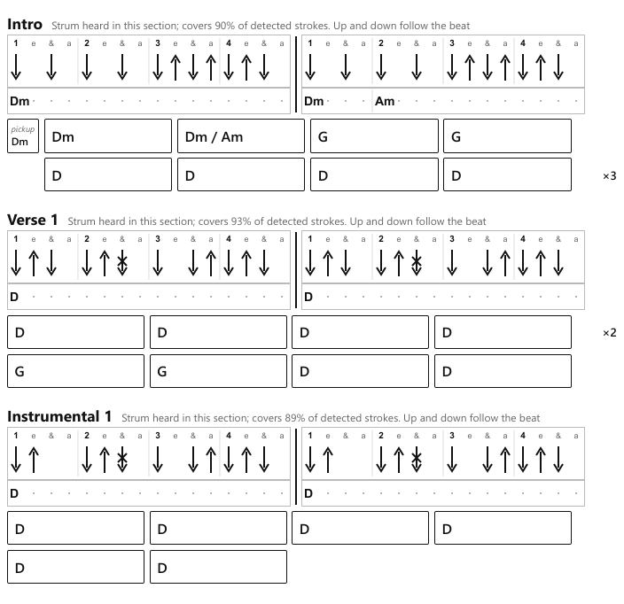
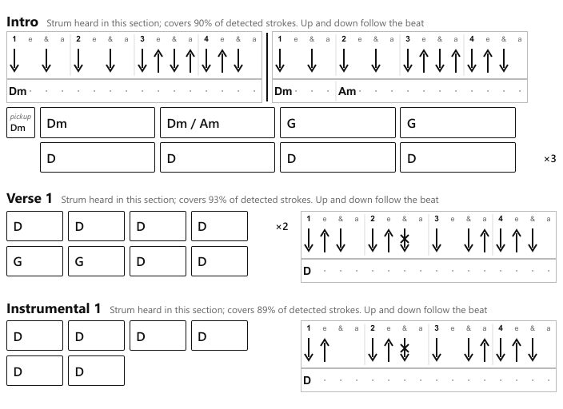

# Version 1.5 research: win back the page

Date: 2026-10-04. Strand: render layout. Question: version 1.3 replaced the one-bar strum box (60 px tall) with a two-bar worked-example strip (90 px tall) and sheets gained a page. Which layout change wins the page back without cramping the sheet?

Everything below was rendered, not reasoned: each variant is the project's own `render_html` run on the seven validation scores (`runs/<song>/06_score/score.json`) with an edited copy of the template and patched strip rules, printed by the project's own `youkelele.render.pdf.html_to_pdf`. No source file, test or run folder was changed. Scratch scripts live in `%TEMP%\youkelele-v15-research\page\` (`render_variants.py`, `analyse_pdfs.py`, `measure_elements.py`, `decompose.py`, `find_wraps.py`, `split_test.py`, `table.py`).

## Answer in brief

- The real page cost is the strip's **height above the rows** (24.3 mm per section, 5 to 10 strips per song). Making the strip one bar wide (variant A) or narrowing its slots (variant C's `slot_px` 24) changes no height and wins nothing on its own: the strip is 90 px tall whatever its width.
- What wins is the combination: **one bar unless a shown bar has a change inside it (A2), and a one-bar strip placed beside the rows instead of above them (R)**. Pages fall from 3, 3, 2, 3, 3, 4, 2 to 2, 3, 2, 2, 2, 3, 2 (20 to 16): Wet Leg and Fame back to two, All Fired Up to three, and Summer of '69 to two as a bonus. No font size changes; no chord cell wraps.
- The cost is narrower chord cells in sections whose strip sits beside them: 25.2 mm (8-slot songs) and 18.8 mm (16-slot songs) instead of 41.0 mm. The headroom on the two tightest sheets is about one row (Fame and Summer of '69 end at 95 and 96 percent of page 2).

## 1. State of the code

| What | Where | Fact that matters for pages |
|---|---|---|
| Strip height | `src/youkelele/render/strum_box.py:17` (`_H = 60`), `:20` (`_CHORD_H = 30`), `:163-164` | The SVG is `_H + _CHORD_H` = 90 px tall for one bar or two; the bar count and `slot_px` only set its width (`len(bars) * n * per_slot + 12 * (len(bars) - 1)`) |
| Slot width | `strum_box.py:15-16`, `:59-61` | 28 px up to 8 slots, 20 px above. Widths measured: two-bar 8-slot 460 px (121.7 mm), two-bar 16-slot 652 px (172.5 mm), one-bar 8-slot 224 px (59.3 mm), one-bar 16-slot 320 px (84.7 mm). Text width is 688 px (182 mm) |
| Bars shown | `strum_box.py:101-118` (`example_bars`) | First two struck full bars; if neither has a change inside it and a later bar does, that bar replaces the second. So a pair with no inner change means the section has no inner change in any struck bar |
| Strip visibility | `src/youkelele/render/html.py:104` (`show_box`), `:118-124` | No strip for uncertain or no-instrument sections (Pour Some Sugar On Me has none) |
| Slot width chosen | `html.py:99` | One `slot_px` per song |
| Strip placement | `src/youkelele/render/templates/sheet.html.j2:99-114` | The strip sits inside `.section-head`, under the title line and above the grid |
| Head rules | `sheet.html.j2:24-26`, `:30` | `.section-head` margin 0 0 1.5mm, `break-inside: avoid`, `break-after: avoid`; `.strum-box` margin 2px 0 0, `break-inside: avoid` |
| Section gap | `sheet.html.j2:23` | `.section { margin-bottom: 5mm }` |
| Rows | `sheet.html.j2:32-34`, `:42` | Grid of 4 cells plus an auto repeat column, gap 1.5mm, margin-bottom 1.5mm; `.cell` 12pt bold, padding 2mm; pickup column `0.25fr` |
| Repeats | `sheet.html.j2:43-47`; `src/youkelele/render/grid.py:73-93` | Repeat column `min-width: 12mm`; repeated rows collapse to one block with `×N` |
| Page | `sheet.html.j2:49-54`; `src/youkelele/render/pdf.py:35-40` | A4, 14 mm margins (content 182 x 269 mm); `page.pdf(format="A4", print_background=True, prefer_css_page_size=True)`, no scale |
| History | `docs/superpowers/specs/2026-10-04-v1-3-validation.md:161` (item 2); `docs/superpowers/specs/2026-10-04-ukulele-tab-chain-v1-3-design.md:80` | The strip replaced the box because box plus strip cost Chelsea Dagger and Fame a page; item 2 names the two options measured here as A and R |

## 2. Method

- **Rendering.** `render_variants.py` copies `sheet.html.j2` to a scratch folder, applies the variant's string edits to the copy, points `youkelele.render.html._ENV` at it, and patches `html.example_bars` and `html.slot_px` for the strip rules. The baseline HTML it produces is byte-identical to each run's `07_render/sheet.html` (all seven checked with `cmp`), and its PDFs reproduce today's page counts 3, 3, 2, 3, 3, 4, 2.
- **Pages and fill.** Page count from pypdf and PyMuPDF 1.28.2. Fill of a page is (lowest inked point minus the 14 mm top margin) divided by the 269 mm content height, from PyMuPDF's bbox log of text, fills and strokes, so it is exact to PDF coordinates. Section heads on each page are found as bold 13pt spans (the `h2`).
- **Element heights.** `measure_elements.py` loads each HTML in Playwright Chromium with `emulate_media("print")` (the same print CSS: `html, body { width: 182mm }`) and reads `getBoundingClientRect` for the header, legend, each section's title line, strip and rows. `decompose.py` splits the continuous height into preamble, section heads, rows, section gaps and the strip, allowing for the margins that collapse (the last row's 1.5 mm into the section gap, the last section's gap out of the sheet), so a song with no strips decomposes to a strip cost of 0.0 mm.
- **Wrapping.** `find_wraps.py` reports any grid row taller than one line of cells, and the narrowest cell, per section.

## 3. Baseline: where the height goes

Per element, measured (identical on all seven songs):

| Element | Height | Count per song | mm per song |
|---|---|---|---|
| Strip (90 px SVG plus 2 px margin) | **24.3 mm** | 0 to 10 (47 in all) | 0 to 243 |
| Section head (title line 6.1 mm plus 1.5 mm margin) | 7.6 mm | 7 to 13 | 53 to 99 |
| Section gap | 5.0 mm | sections less one | 30 to 60 |
| Chord row (10.1 mm cell plus 1.5 mm gap) | 11.6 mm | 17 to 32 | 186 to 360 |
| Header (title, artist, facts, 0 to 3 note lines) | 31.5 to 53.8 mm | 1 | 31.5 to 53.8 |
| Chord legend (head, 80 x 100 px diagrams, passing and capo lines) | 39.3 mm plus about 6.2 mm per passing, capo or power line | 1 | 39.3 to 51.7 |
| Repeat marks | 0 mm tall; 12 mm of width per row | | save 46 to 139 mm |

Per song (mm; slack is page space lost to breaks before the last page):

| Song | Continuous height | Preamble | Section heads | Rows | Gaps | Strips | Break slack | Rows saved by repeats | Pages |
|---|---|---|---|---|---|---|---|---|---|
| Summer of '69 | 713.5 | 75.8 | 91.0 | 248.3 | 55.0 | **243.3** (10) | 52.9 | 115.8 (23 of 33 rows) | 3 |
| Chelsea Dagger | 677.0 | 87.9 | 53.1 | 360.0 | 30.0 | **145.9** (6) | 32.1 | 81.1 (32 of 39) | 3 |
| Pour Some Sugar On Me | 467.0 | 105.5 | 60.7 | 265.9 | 35.0 | 0.0 (0) | 15.3 | 46.3 (24 of 28) | 2 |
| Wet Leg "mangetout" | 574.6 | 76.8 | 68.3 | 194.9 | 40.0 | **194.7** (8) | 40.6 | 138.9 (18 of 30) | 3 |
| Fame | 639.7 | 94.4 | 68.3 | 218.1 | 40.0 | **219.0** (9) | 0.0 | 81.1 (20 of 27) | 3 |
| All Fired Up | 787.3 | 70.3 | 98.6 | 339.4 | 60.0 | **218.9** (9) | 85.6 | 138.9 (31 of 43) | 4 |
| Need You Tonight | 467.9 | 76.8 | 53.1 | 186.3 | 30.0 | **121.6** (5) | 30.1 | 81.1 (17 of 24) | 2 |

Two pages hold 538 mm. The strips are a quarter to a third of every sheet that has them (47 strips, 1,144 mm, over four pages across the seven songs), and the only element that is pure overhead per section besides the 7.6 mm head and 5 mm gap. Against the 1.2 box (60 px, 15.9 mm) each strip costs 7.9 mm more. Repeats already save more than a page per song in total; the legend and header are fixed per sheet. Break slack is the wildcard: All Fired Up loses 85.6 mm (a third of a page) to breaks, which is why it prints four pages from 2.93 pages of content.

Baseline page breaks (sections starting on each page; "cont." where a section carries over; fill of each page):

| Song | Page 1 | Page 2 | Page 3 | Page 4 |
|---|---|---|---|---|
| Summer of '69 | Intro to Chorus 1 (0.88) | Verse 2 to Bridge (0.90) | Instrumental to Outro (**0.85**) | |
| Chelsea Dagger | Intro to Verse 1 (1.00) | cont., Chorus 2, Verse 2 (0.86) | Instrumental, Chorus 3 (**0.64**) | |
| Pour Some Sugar On Me | Intro to Chorus 1 (0.93) | Verse 2 to Chorus 3 (**0.79**) | | |
| Wet Leg | Verse 1 to Verse 2 (0.92) | Chorus 2 to Verse 5 (0.90) | Chorus 3, Outro (**0.29**) | |
| Fame | Intro to Instrumental 1 (0.99) | Verse 2 to Verse 3 (0.98) | Instrumental 3, Verse 4 (**0.38**) | |
| All Fired Up | Intro to Verse 2 (0.90) | Chorus 1 to Verse 5 (0.85) | Verse 6 to Chorus 3 (0.89) | Outro (**0.24**) |
| Need You Tonight | Intro to Chorus 1 (0.88) | Verse 2 to Outro (**0.85**) | | |

To lose its last page, Wet Leg must shed at least 37 mm plus whatever break slack it keeps, Fame at least 102 mm, and All Fired Up must cut its break slack or shed 65 mm.

## 4. Variants measured

| Code | Change |
|---|---|
| base | Today |
| A1 | One-bar strip when the two bars `example_bars` picks each hold one chord and it is the same chord; otherwise as today (28 of 47 strips become one bar) |
| A2 | One-bar strip unless a shown bar has a change inside it (36 of 47 become one bar; since `example_bars` already pulls in a later changing bar, two bars means the section has an inner change) |
| B | Strip on the title line, right-aligned: `.section-head` as a wrapping flex row, title column at least 45 mm; a strip too wide to fit beside 45 mm drops under the title as today |
| R | A one-bar strip sits beside the rows (CSS grid: rows in `minmax(0, 1fr)`, strip in an `auto` column, 4 mm gap, top-aligned); two-bar strips stay above the rows; pickup column given `minmax(13mm, 0.25fr)` so the "pickup" label does not wrap in the narrower grid |
| C | Section gap 5 to 3.5 mm, row gap and row margin 1.5 to 1 mm, cell padding 2 to 1.5 mm, `slot_px` 28 to 24 (8-slot songs) |
| S86 | The strip scaled to 24/28 (`zoom: 0.8571` on `.worked-example`), so its height falls too (24.3 to 20.9 mm) |
| M4 | Section gap 5 to 4 mm only |
| D1, D2 | All Fired Up only: adjacent "verse" sections merged in a copy of `score.json` (bars concatenated, first section's pattern kept). D1 merges sections 5 to 8 (the Em, D, G cycle and its fragments); D2 merges every adjacent same-label run (1 with 2, and 4 to 8), leaving 8 sections |

## 5. Results: pages (last-page fill)

| Variant | Summer of '69 | Chelsea Dagger | Pour Some Sugar | Wet Leg | Fame | All Fired Up | Need You Tonight | Total |
|---|---|---|---|---|---|---|---|---|
| base | 3 (0.85) | 3 (0.64) | 2 (0.79) | 3 (0.29) | 3 (0.38) | 4 (0.24) | 2 (0.85) | 20 |
| A1 | 3 (0.85) | 3 (0.64) | 2 (0.79) | 3 (0.29) | 3 (0.38) | 4 (0.24) | 2 (0.85) | 20 |
| A2 | 3 (0.85) | 3 (0.64) | 2 (0.79) | 3 (0.29) | 3 (0.38) | 4 (0.24) | 2 (0.85) | 20 |
| B | 3 (0.43) | 3 (0.41) | 2 (0.79) | **2** (0.94) | 3 (0.37) | **3** (0.72) | 2 (0.84) | 18 |
| A1 + B | 3 (0.43) | 3 (0.41) | 2 (0.79) | **2** (0.94) | 3 (0.33) | **3** (0.72) | 2 (0.84) | 18 |
| A2 + B | 3 (0.43) | 3 (0.41) | 2 (0.79) | **2** (0.94) | 3 (0.33) | **3** (0.72) | 2 (0.82) | 18 |
| A1 + R | 3 (0.46) | 3 (0.33) | 2 (0.79) | **2** (0.78) | **2** (0.95) | **3** (0.29) | 2 (0.85) | 17 |
| **A2 + R (recommended)** | **2** (0.96) | 3 (0.33) | 2 (0.79) | **2** (0.69) | **2** (0.95) | **3** (0.29) | 2 (0.61) | **16** |
| A2 + R + B | **2** (0.96) | 3 (0.31) | 2 (0.79) | **2** (0.67) | **2** (0.95) | **3** (0.29) | 2 (0.60) | 16 |
| A2 + R + M4 | **2** (0.93) | 3 (0.33) | 2 (0.78) | **2** (0.68) | **2** (0.94) | **3** (0.29) | 2 (0.55) | 16 |
| A2 + R + C | **2** (0.89) | 3 (0.11) | 2 (0.60) | **2** (0.53) | **2** (0.89) | **3** (0.27) | 2 (0.48) | 16 |
| C | 3 (0.79) | 3 (0.35) | 2 (0.60) | 3 (0.27) | 3 (0.36) | **3** (0.86) | 2 (0.63) | 19 |
| S86 | 3 (0.61) | 3 (0.46) | 2 (0.79) | 3 (0.27) | 3 (0.35) | **3** (0.95) | 2 (0.81) | 19 |
| C + S86 | 3 (0.41) | 3 (0.29) | 2 (0.60) | **2** (0.91) | 3 (0.33) | **3** (0.63) | 2 (0.57) | 18 |
| C + S86 + B | 3 (0.21) | 3 (0.11) | 2 (0.60) | **2** (0.73) | 3 (0.33) | **3** (0.44) | 2 (0.56) | 18 |
| D1 (merge verses 5 to 8) | | | | | | **3** (0.72) | | |
| D2 (merge every adjacent run) | | | | | | **3** (0.42) | | |
| A2 + R + D1 | | | | | | 3 (0.16) | | |
| A2 + R + D2 | | | | | | **2** (0.99) | | |

What each variant shows:

- **A alone wins nothing.** A one-bar strip is exactly as tall as a two-bar strip (`strum_box.py:164`), so A1 and A2 give the same page counts and the same fill on every page as today. The one-bar rule only matters as the enabler of R and B, because it makes the strip narrow enough to sit beside something.
- **B (strip on the title line)** saves the 6.1 mm title line per strip section, and only where the strip fits beside a 45 mm title column: an 8-slot two-bar strip (121.7 mm) does, a 16-slot two-bar strip (172.5 mm) does not, so Fame and Need You Tonight barely move. With a one-bar strip the long label ("Strum heard in this section; covers N% ...") wraps to two or three lines in the title column and the head is still the strip's height. B gets Wet Leg and All Fired Up but not Fame.
- **R (strip beside the rows)** saves the whole strip in every section of two or more rows (two rows stack to 23.2 mm against the strip's 23.8 mm) and half of it in a one-row section. Under A2, 36 of 47 strips go beside the rows; the 11 two-bar strips stay above. Strip cost per song falls from 121.6 to 243.3 mm to 29.0 to 88.5 mm (Fame keeps 88.5 mm because three of its nine sections show a change inside a bar). A1 + R gets the three targets; A2 + R also takes Summer of '69 to two pages, because its three choruses (Bm then A), bridge and instrumental lose their second bar and move beside.
- **C (tighter metrics)** saves 1.5 mm per row and 1.5 mm per section gap, which measured 31 to 57 mm of continuous height per song (Wet Leg 34.5, Fame 36.6, All Fired Up 57.2). The `slot_px` change from 28 to 24 is width only and saves no height. C alone gets only All Fired Up, by cutting its break slack; with the strip scaled (S86, 3.4 mm per strip) it also gets Wet Leg, never Fame.
- **D (merging sections)** gets All Fired Up to three pages on its own (D1 or D2) by removing section heads, gaps and strips (D2: 13 to 8 sections, 9 to 5 strips), and to two pages with A2 + R, but at 0.99 fill, with no headroom at all. The merge is another strand's decision; on layout grounds it is not needed for the three-page target.

## 6. Recommendation

**A2 + R: draw one bar unless a shown bar has a change inside it, and put a one-bar strip beside the section's rows.** Measured result: 2, 3, 2, 2, 2, 3, 2 pages (16 against 20), every target met, no font size touched, no row wraps (`find_wraps.py` on all seven), and the strip still shows every in-bar change it shows today (a section with an inner change keeps its two-bar strip above the rows).

The strip rule (add to `strum_box.py` beside `example_bars`, leaving `example_bars` and its tests as they are):

```python
def strip_bars(section: ScoreSection) -> list[ScoreBar]:
    """The bars the strip draws: the example bars when one of them changes chord inside the bar,
    otherwise the first alone (the bar-to-bar changes are already in the grid)."""
    bars = example_bars(section)
    return bars if any(len(b.chords) > 1 for b in bars) else bars[:1]
```

`html.py` calls `strip_bars` in place of `example_bars` at `:120` and adds `"beside": show_box and len(bars) == 1` to the section dict (the measured template sniffed for the SVG's `bar-line` instead; the outcome is the same).

The template change (`sheet.html.j2:111-144`): the strip leaves `.section-head` when `section.beside`, and the grid and strip share a wrapper:

```jinja
        
        <div class="strum-box"><div class="worked-example">{{ section.example }}</div></div>
        
      </div>
      <div class="section-body beside">
      
      <div class="grid has-pickup">
      ... rows unchanged ...
      </div>
      <div class="strum-box"><div class="worked-example">{{ section.example }}</div></div>
      </div>
    </section>
```

The CSS, added before `@page`:

```css
  .section-body.beside { display: grid; grid-template-columns: minmax(0, 1fr) auto; column-gap: 4mm; align-items: start; }
  .section-body.beside > .strum-box { grid-column: 2; grid-row: 1; margin: 0; }
  .section-body.beside .grid.has-pickup .row { grid-template-columns: minmax(13mm, 0.25fr) repeat(4, minmax(0, 1fr)) auto; }
```

No other metric changes. `.section-head` keeps `break-after: avoid`, so a head still never ends a page without its first row.

Recommended variant's page breaks:

| Song | Page 1 | Page 2 | Page 3 |
|---|---|---|---|
| Summer of '69 | Intro to Chorus 2 (0.94) | Verse 3 to Outro (**0.96**) | |
| Chelsea Dagger | Intro to Verse 1 (0.96) | cont., Chorus 2 to Instrumental (0.95) | Chorus 3 (**0.33**) |
| Pour Some Sugar On Me | unchanged (0.93) | unchanged (**0.79**) | |
| Wet Leg | Verse 1 to Chorus 2 (0.89) | Verse 3 to Outro (**0.69**) | |
| Fame | Intro to Verse 2 (0.96) | Instrumental 2 to Verse 4 (**0.95**) | |
| All Fired Up | Intro to Verse 3 (1.00) | Verse 4 to Verse 8 (0.98) | Chorus 3, Outro (**0.29**) |
| Need You Tonight | Intro to Verse 2 (0.97) | cont., Chorus 2 to Outro (**0.61**) | |

Chelsea Dagger stays at three: it is row-heavy (32 rows, 360 mm) and three of its six strips show inner changes, so they stay above; its continuous height falls only from 677 to 608 mm. Getting it to two would need C as well and still fails (A2 + R + C: three pages, the third holding only the end of Chorus 3 at 0.11).

Before and after, Fame page 1 (Intro keeps its two-bar strip above, because bar 2 changes Dm to Am inside the bar; Verse 1 and Instrumental 1 move their one-bar strip beside the rows):





### Optional headroom: C on top

Fame and Summer of '69 end at 95 and 96 percent of page 2 under A2 + R, leaving 13 and 11 mm, about one chord row. If the owner wants margin against a run that adds a row, A2 + R + C ends both at 0.89 (30 mm) with the same page counts. M4 (section gap 4 mm alone) buys almost nothing (Fame 0.95 to 0.94) and is not worth a change.

## 7. Readability trade-offs

| Item | Today | A2 + R | Plus C |
|---|---|---|---|
| Chord cell text | 12pt bold (10pt when three or more chords) | unchanged | unchanged |
| Strip chord names, beat labels, sub-beat labels | 14 px (10.5pt), 10 px (7.5pt), 9 px (6.75pt) | unchanged | unchanged (C's `slot_px` 24 narrows slots from 7.4 to 6.4 mm on 8-slot songs; S86 would cut these to 9.0pt, 6.4pt, 5.8pt and is not recommended) |
| Cell width, section with strip beside | 41.0 mm (38.2 with pickup) | **25.2 mm** (8-slot), **18.8 mm** (16-slot); 21.6 mm with pickup | same |
| Cell width, other sections | 41.0 mm | unchanged | unchanged |
| Cell height (box) | 10.1 mm | unchanged | 9.1 mm (padding 1.5 mm) |
| Gap between sections | 5 mm | unchanged | 3.5 mm |
| What the strip shows | Two bars always | One bar unless a bar changes chord inside it; that bar's chord row still names the chord | same |

Costs to name honestly:

- **Column widths differ between sections on one page.** A section with its strip beside it has narrower cells than its neighbour with the strip above or no strip (visible in the Fame crop: Intro's cells against Verse 1's). The grid still reads left to right in fours, and the bar count per row is unchanged, but the page is less uniform than today.
- **16-slot cells are tight.** At 18.8 mm a cell holds "Dm / Am" at 12pt bold with about 1 mm to spare. No cell wraps on any of the seven sheets; a longer two-chord name (for example "C#m7 / G#m") would wrap to a second line in a beside section and add about 5 mm to that row.
- **The repeat mark sits between the cells and the strip.** `×2` reads with its row as before, but it is now 4 mm from the strip's left edge; a reader could take it as applying to the strip. Not seen as confusing in the renders, but untested with a player.
- **The second bar goes when it adds nothing.** A section whose strip showed two bars of one chord, or Bm then A at the bar line, now shows one bar; the grid below already shows the bar-to-bar change. This is the substance of the 1.3 validation's own option, and every in-bar change is still drawn.

## 8. Risks

- **Thin headroom on the targets.** Fame (0.95) and Summer of '69 (0.96) regain their page by about one row. A 1.5 run that adds a section, a row, a note line in the header or a passing-chord line in the legend can push either back to three. Mitigation: C on top (0.89), or a slow test that asserts page counts on the validation runs.
- **Breaking inside a beside section.** Chromium fragments the grid wrapper cleanly between rows: a constructed 16-row beside section (Wet Leg's Chorus 1 stretched to 64 bars, `split_test.py`) broke between rows 12 and 13, the strip stayed on page 1 beside the first rows, and the continued rows kept their column widths. Not seen on the seven real sheets, where no beside section crosses a page.
- **Template and test churn.** `tests/test_html.py` and `tests/test_stage_render.py` check the strip markup; any test that expects two bars in a section with no inner change, or the strip inside `.section-head`, changes. `tests/test_strum_box.py` is untouched if the rule lives in a new `strip_bars`.
- **Uncertain sections are unaffected.** Pour Some Sugar On Me (every section uncertain, no strips) renders identically under every strip variant; if 1.5's confidence work makes its sections certain, it gains strips and up to 24.3 mm each above, or about 12 mm each beside its three-row sections.
- **D is not a layout decision.** Merging sections changes what the sheet says; the page gain is measured here only as a what-if for the strand deciding the merge.

## Assumptions

| Assumption | Status | Cost if wrong |
|---|---|---|
| The scratch renderer is the production renderer: same `render_html`, same `html_to_pdf`, same Chromium | Verified: baseline HTML byte-identical to all seven `07_render/sheet.html`; page counts reproduce 3, 3, 2, 3, 3, 4, 2 | Every figure here would need re-running |
| Strip height does not depend on bar count or `slot_px` | Verified in code (`strum_box.py:163-164`) and measured (A1 and A2 PDFs identical in page count and fill to base) | None |
| Fill from the PDF's ink bbox equals usable page height consumed | Measured; page-sized background fills are excluded | A few mm per page; no page count depends on it |
| Element heights from print-media layout match the PDF | Measured: decomposition of Pour Some Sugar On Me (no strips) leaves 0.0 mm residual once collapsed margins are allowed for | Per-element mm figures off by up to 1.5 mm per section |
| Cells as narrow as 18.8 mm hold every chord cell without wrapping | Measured on the seven validation sheets only | A wrapped row adds about 5 mm; in the worst case a sheet near its limit regains a page |
| A beside section breaks cleanly across pages | Measured on one constructed case (`split_test.py`) in this Chromium | A badly placed break, strip separated from its rows; would need `break-inside: avoid` on the wrapper for short sections |
| One bar is enough when no bar changes inside it, because the grid shows bar-to-bar changes | Unverified with a player | Revert to A1 + R: the three targets still hold (Wet Leg 2, Fame 2, All Fired Up 3) but Summer of '69 stays at 3 |
| Players accept differing cell widths between sections | Unverified | Reserve the strip column in every section with a strip (wider strips above would then need the space anyway), or drop R and accept B + C + S86 (Wet Leg and All Fired Up only, Fame stays 3) |
| The seven runs represent future sheets (8 and 16 slots, 4/4, easy tier) | Unverified for 3/4, 6/8 and full tier; 12-slot bars take 20 px slots (`slot_px`), a 240 px one-bar strip, narrower than the 16-slot one measured here | A 12-slot or full-tier sheet could behave differently; the rule and CSS do not depend on the meter |
| The merge what-if (D) uses the first section's pattern and flags | Assumption of this measurement only | The page effect is the same whatever pattern is kept; only strip visibility (certain or uncertain) could change a strip's presence |
